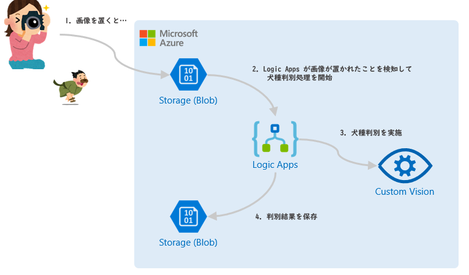

# コーディング無しで犬の画像から犬種を見分けるAIアプリ開発

Microsoft Azure の以下のサービスを活用し、コーディング無しで画像から犬種を判別するアプリの開発をします。

- **Custom Vision**:
  ごくわずかな作業で独自の画像分類およびオブジェクト検出のアルゴリズムを構築できるサービス
- **Logic Apps**:
  コーディング無しでクラウドやオンプレミスにあるアプリを統合しワークフローを構築できるサービス

## 概要

画像を Azure の Blob Storage に置くと、以下の動作をするアプリを開発します。

1. ユーザーが、Blob Storage (ファイル保存用)に画像を保存する
1. Logic Apps が、Blob Storage (ファイル保存用)にファイルが置かれたことを検知して処理を開始
1. Logic Apps の処理で、画像を Custom Vison Service で分析
1. Logic Apps の処理で、分析した結果を Blob Storage (結果保存用)に保存

## ゴール

このハンズオンでは、以下を理解することをゴールとしています。

- Custom Vision の基本的な利用方法を知る
- Logic Apps に触れてみる

## 前提・準備

- Azure のサブスクリプションが必要となります。開始前にご準備ください。
- Azure ポータルや Custom Vision ポータルでの操作には、モダンなブラウザー(Chrome や FireFox, Microsoft Edgeなど)が必要です。

## ハンズオンの構成

|Chapter|概要|
|--:|---|
|1|[Custom Vision で犬種判別の分類器作成](./docs/01_create-custom-vision.md)|
|2|[Logic Apps で Custom Vision を使ったアプリ開発](./docs/02_create-logic-apps.md)|
|3|[PowerApps で Custom Vision を使ったアプリ開発](./docs/03_create-powerApps.md)|
|-|[リソースグループの削除](./docs/cleanup_resources.md)|

---

ハンズオンを開始しましょう。

[進む](./docs/01_create-custom-vision.md)