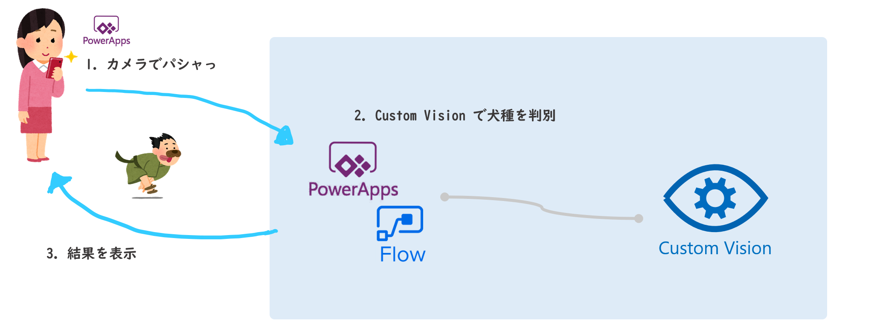

# コーディング無しで犬の画像から犬種を見分けるAIアプリ開発

Microsoft Azure の Cognitive Services のひとつ、**Custom Vision** で画像から犬種を判別する分類器を作成します。また、**Logic Apps**、**PowerApps** を使って Custom Vision を活用したアプリを開発します。

## 概要

3つの構成でアプリを開発します。

1. Custom Vision で犬種が判別できる分類器を作成します。この分類器を **2** と **3** で使います。
2. 写真をクラウド上（Azure Blob Storage）に保存したことを検知して動作する **Logic Apps** を開発します。犬種の判別結果はクラウド上（Azure Blob Storage）に保存します。
  
3. **PowerApps** を使い、カメラで撮った写真がどの犬種かの結果を表示するモバイルアプリを開発します。
  

## ゴール

このハンズオンでは、以下を理解することをゴールとしています。

- Custom Vision の基本的な利用方法を知る
- イベントドリブンで動作する Logic Apps の基礎を理解する
- PowerApps で Custom Vision を組み込んだモバイルアプリの開発の基礎を理解する

## 前提・準備

- Azure のサブスクリプションが必要となります。開始前にご準備ください。
- Azure ポータルや Custom Vision ポータルでの操作には、モダンなブラウザー(Chrome や FireFox, Microsoft Edge など)が必要です。
- PowerApps のハンズオンを行う場合は、ライセンスが必要です。ご不明のかたは[**こちら**](https://docs.microsoft.com/ja-jp/powerapps/maker/signup-for-powerapps)をご確認ください。

## ハンズオンの構成

|Chapter|概要|
|--:|---|
|1|[Custom Vision で犬種判別の分類器作成](./docs/01_create-custom-vision.md)|
|2|[Logic Apps で Custom Vision を使ったアプリ開発](./docs/02_create-logic-apps.md)|
|3|[PowerApps で Custom Vision を使ったモバイルアプリ開発](./docs/03_create-powerApps.md)|
|-|[リソースグループの削除](./docs/cleanup_resources.md)|

> **1** で作成した分類器を **2** と **3** で使います。お好みに合わせて **1→2→3** と順番勧めることも **1→3** と進めることもできます。

---

ハンズオンを開始しましょう。

[進む](./docs/01_create-custom-vision.md)