# Chapter 1. Custom Vision で犬種判別の分類器作成

このChapterでは、このハンズオンで用意した犬の画像を Custom Vision にアップロードして学習させ、WebAPIとして外部からアクセスできるようにします。

## Custom Vision について

Azure Custom Vision では以下のことができます。

- 画像分類
  - 画像をアップロードして学習させることで、独自の画像分類器を構築。
- オブジェクトの検出
  - 画像をアップロードして学習させることで、独自の画像分類器を構築。オブジェクトの座標もわかる。
- 作成した分類器のバージョン管理
- 作成した分類器を WebAPI として公開

他にも機能はありますので、詳細は[公式ドキュメント](https://docs.microsoft.com/ja-jp/azure/cognitive-services/custom-vision-service/)をご参照ください。

## STEP 1-1. Custom Vision のインスタンス作成

まず、Azure Portal (URL: https://portal.azure.com/ ) を開き、左側にある **リソースの作成** をクリックします。

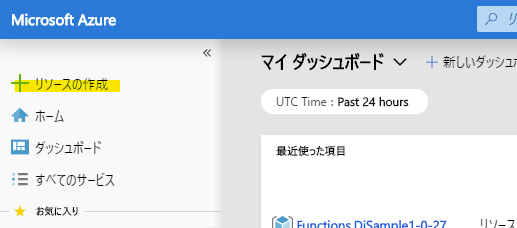

&nbsp;

検索欄に「Custom Vision」と入力して **Cstom Vision** を選択し、**作成** ボタンをクリックします。

以下を参考に詳細情報を入力します。

- **名前**: 任意の名前を入力(例:「decode-dog-classification」)
- **サブスクリプション**: 任意のサブスクリプションを入力
- **場所**: 「(アジア太平洋)東日本」
- **予測価格レベル**: 「F0」
- **トレーニング価格レベル**: 「F0」
- **リソースグループ**: 新規作成をクリックし、任意の名前を入力(例:「decode-cogbot-RG」)

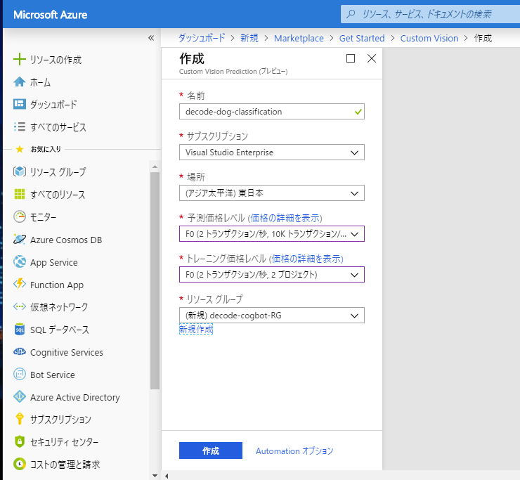

&nbsp;

**作成** ボタンをクリックして作成します。画面左上の完了の通知が出るのを待ちます（10秒程度で作成が完了します）。

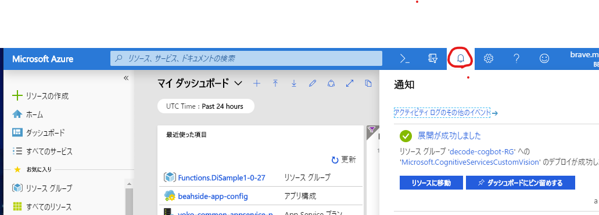

&nbsp;

## STEP 1-2. 画像分類器の作成

Custom Vision のポータル (URL: https://www.customvision.ai ) を開きます。サインインしていない場合は、サインインします。

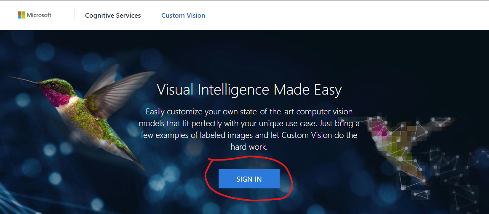

&nbsp;

画面左上の自身をアイコンをクリックし、Azure ポータルで操作した際の **DIRECTORIES** を選択します。

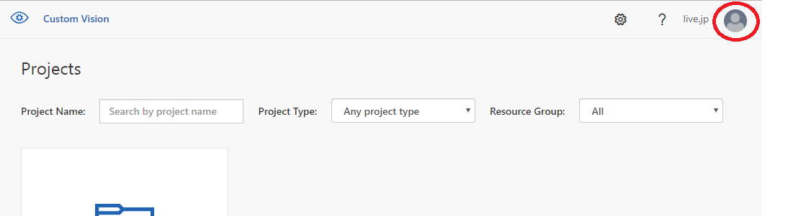

&nbsp;

**NEW PROJECT** をクリックして新規プロジェクトを作成します。

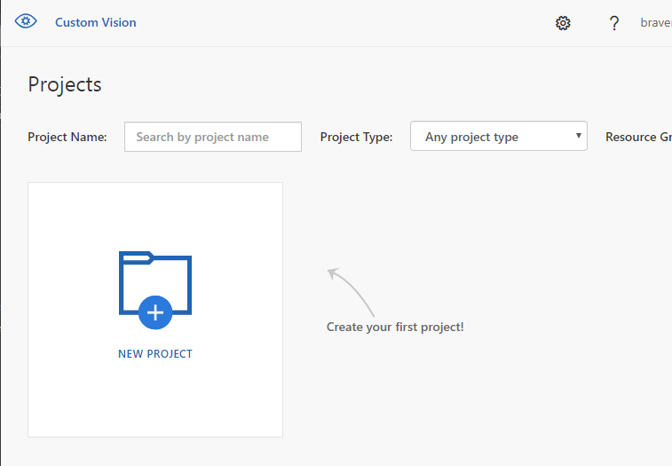

&nbsp;

以下を参考に詳細情報を入力します。入力後、**Create Project** ボタンをクリックします。

- **Name**: 任意の名前を入力(例:「犬種分類」)
- **Description**: 任意に入力
- **Resource Group**: Azure Portal で作成したリソースグループを選択します。選択肢にない場合は、前述で選択した DIRECTOREIS が誤っている可能性があります。
- **Project Types**: 「Classification」
- **Classification Types**: 「Multiclass (Single tag per image)」
- **Domains**: 「General」

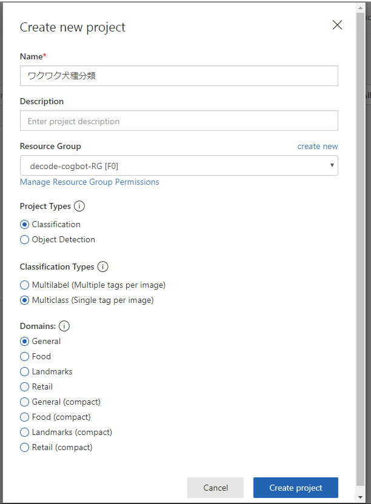

&nbsp;

## STEP 1-3. 犬の画像をダウンロード

分類器にアップロードし学習させる犬の画像を用意していますので、ダウンロードしましょう。

以下のリンクのページ（このGitHub リポジトリーの sample-dog-images/dogs.zip ）を開き、**Download** ボタンをクリックして zip ファイルをダウンロードします。ダウンロードしたら任意の場所に展開しておきましょう。

https://github.com/beachside-project/dog-breed-classification/blob/master/sample-dog-images/dogs.zip

&nbsp;

この中は、各フォルダが犬種名になっており、それぞれの画像が入っています。

## STEP 1-4. 分類器へ画像をアップロード

分類器をトレーニングするための画像をアップロードします。教師あり学習をするため、それぞれの画像に犬種のタグにセットしてアップロードします。

まず、STEP 1-2 の **Create Project** か完了すると、以下のように空のワークスペースが表示されます。画面中央の **Add images** ボタンをクリックします。

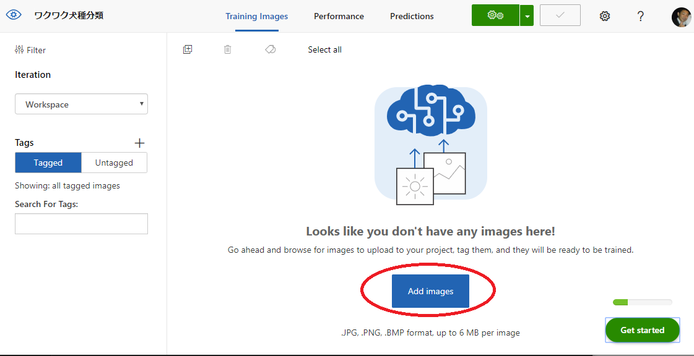

&nbsp;

STEP 1-3 で展開したフォルダの中で **beagle** フォルダを開き、30枚全ての画像を選択します。  
**MyTags** に「beagle」と入力し、**Upload 30 files** ボタンをクリックします。

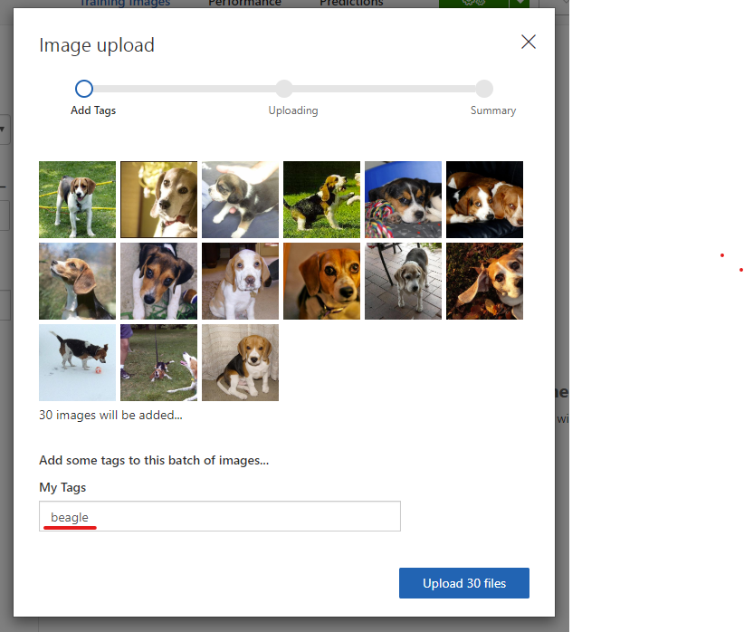

&nbsp;

成功するとダイアログが表示されますので、**Done** ボタンをクリックします。

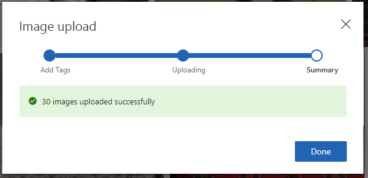

&nbsp;

これで、アップロードしたファイルに **beagle** とタグ付けされました。

ワークスペースで **Add images** ボタンをクリックし、同様の手順で、他のフォルダ（注意:**testset**フォルダはテスト用なのでアップロードしないでください）のファイルもアップロードし、**MyTags** にはそれぞれの犬種（フォルダ名）を入力しましょう。

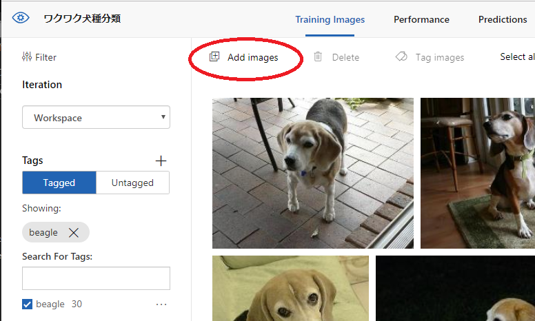

&nbsp;

7種全ての画像をアップロードすると、ワークスペースの左側に犬種が表示され、画像をフィルタリングできるようなります。

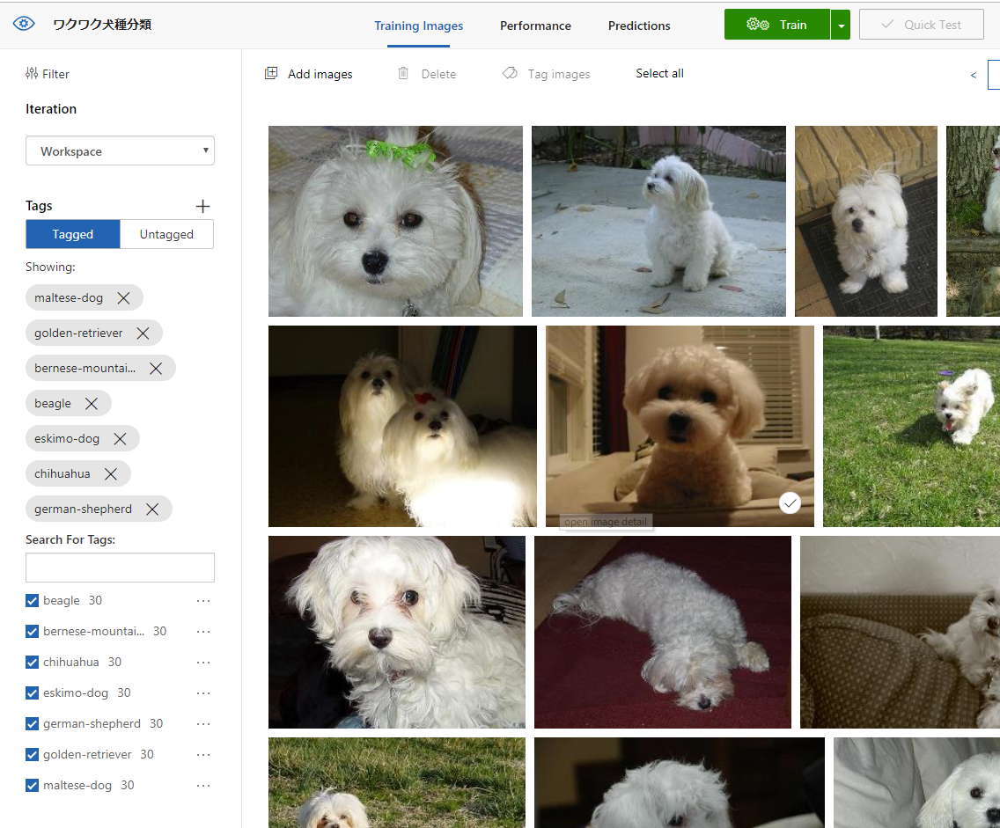

&nbsp;

## STEP 1-5. 分類器をトレーニング

画面上部の **Train** ボタンをクリックすると、トレーニングが開始されます。数秒で完了します。

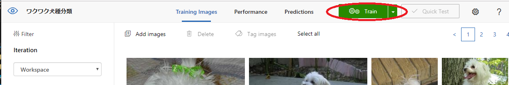

&nbsp;

トレーニングが完了すると、 自動で **Perfomace** タブに移動します。ここでは、トレーニングしたモデルの評価指標を確認でいます。

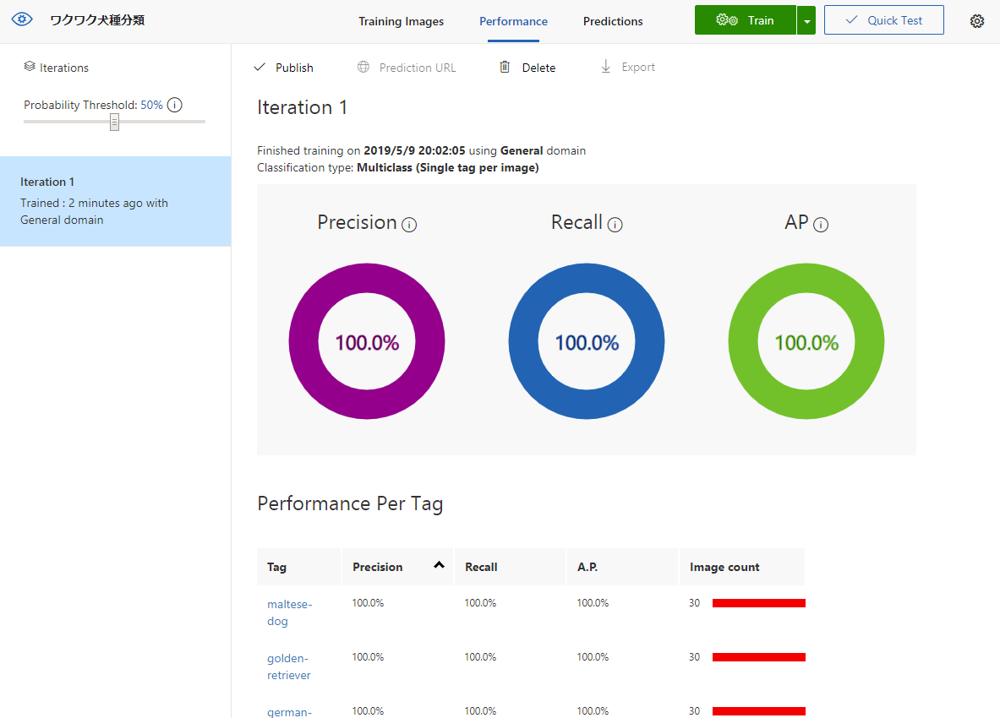

&nbsp;

評価結果については、[こちらの公式ドキュメント](https://docs.microsoft.com/ja-jp/azure/cognitive-services/custom-vision-service/getting-started-build-a-classifier#evaluate-the-classifier)に記載があります。

## STEP 1-6. 分類器でテスト

学習していない **testset** フォルダの画像を使って簡易のテストをしてみましょう。

画面右上の **Quick Test** をクリックします。

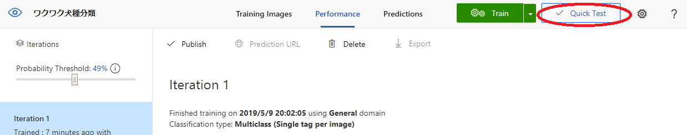

&nbsp;

Quick Test ウインドウが開きます。
ここでは、画像のURLやローカルのパスを入力してテストすることができます。

**Browse local files** をクリックし、**testset** フォルダのファイルを選択して見ましょう。画像が分析され、分析の結果が表示されます。

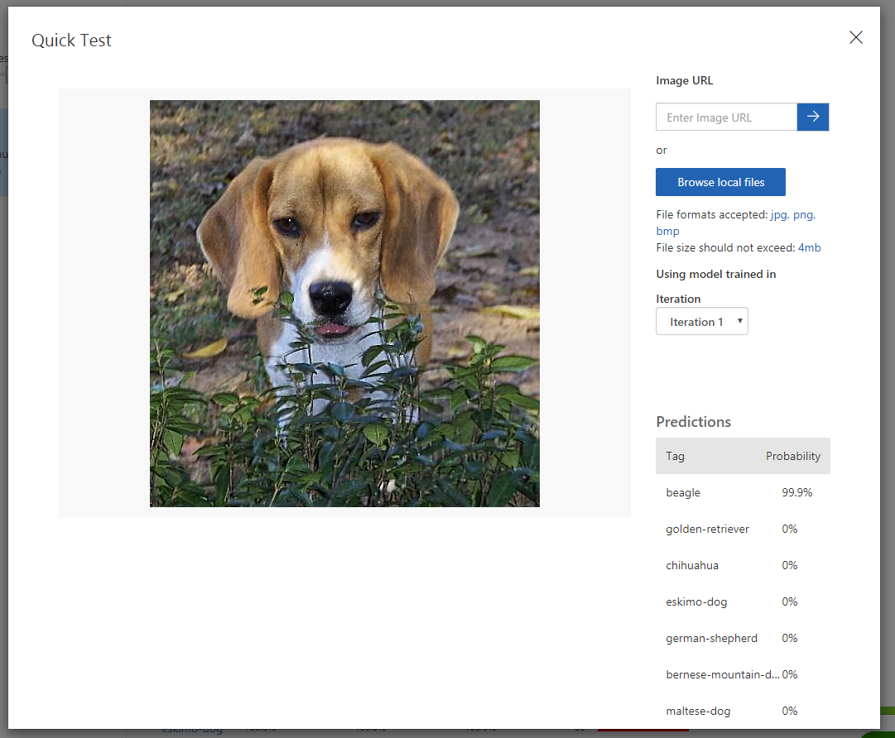

&nbsp;

画面上部の **Predictions** をクリックすると、テストした画像が表示されます。トレーニングをしていない新しい画像の収集は貴重です。ここで表示された画像をクリックして正しいタグを付与することができます。その後、再度トレーニングを実施してモデルの精度を向上することができます。

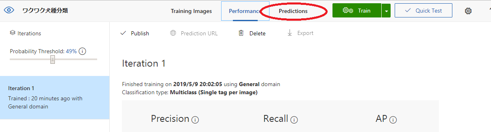

&nbsp;

## STEP 1-6. 分類器をWebAPIとして公開

トレーニングした分類器を WebAPI として公開し、外部からアクセスできるようにします。

画面上部の **Performance** をクリックし、 **Publish** をクリックします。

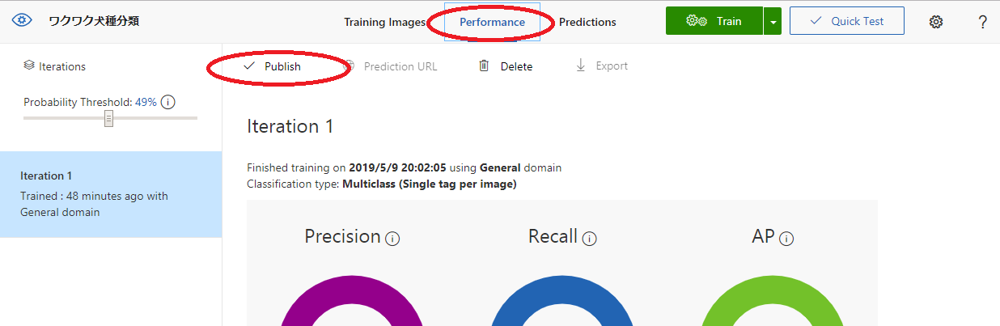

&nbsp;

ウインドウが表示されますので、任意の Publish name を入力して **publish** ボタンをクリックします。

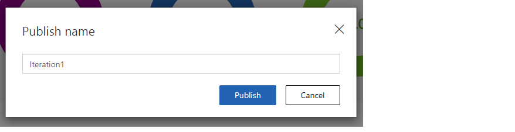

&nbsp;

画面左にの「Iteration 1」の横に **PUBLISHED** と表示されます。トレーニングをするごとに分類器のモデルのバージョンがここに表示され、管理することが可能です。

画面上部中央の **Prediction URL** をクリックすると、「Iteration 1」へ WebAPI でアクセスするのに必要な情報が表示されます。次の Chapter で Logic Apps から入力する際に利用します。

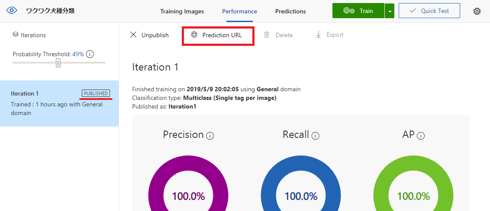

&nbsp;

## NEXT STEP

**おめでとうございます！**:star2:  
機械学習のコーディングなしで犬の画像分類器の作成し、利用できるようになりました。

次の Chapter では Logic Apps を使ってこの分類器にアクセスし、アプリを完成させます。

---

[戻る](../README.md) | [次へ進む](./02_create-logic-apps.md)