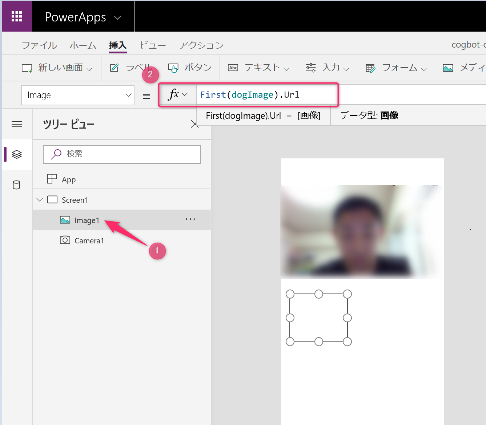

# Chapter 3. PowerApps で Custom Vision を使ったアプリ開発

この Chapter では、PowerApps を利用して、モバイルアプリを開発します。スマートフォーンから写真を撮り、Custom Vision を使って犬種の判別結果を表示できるようにします。


## PowerApps について

PowerApps を使うと、ポイントアンドクリックの操作でアプリを設計し、素早く構築できます。豊富なテンプレートを基に作成することも、新しく作成することもできます。アプリはデータと簡単に接続でき、Excel のような数式を使ってロジックを簡単に追加できます。アプリは Web、iOS、Android、および Windows 10 向けに発行できます。すべての手順が簡単です。

([公式サイトより引用](https://powerapps.microsoft.com/ja-jp/))

このハンズオンで実際に体感してみましょう。

&nbsp;

## STEP3-1. PowerApps のアプリの新規作成

[PowerApps のホーム](https://make.powerapps.com/home)を開き、**キャンパス アプリを一から作成** をクリックします。


画面が表示されたら以下を参考に入力し、**作成** ボタンをクリックします。

- **アプリ名**: 任意の名前を入力
- **形式**: 「電話」 を選択


ヒントのポップアップが表示される場合は、**スキップ** します。

&nbsp;

## STEP3-2. カメラの追加

以下の機能を実装します。

- カメラをタップするとカメラが撮影する
- 撮れた画像をプレビュー表示する

まずカメラを挿入します。画面上部のメニュー **挿入** > **メディア** > **カメラ** をクリックします。


カメラを画面の上部に配置しましょう。サイズは任意に調整します。

&nbsp;

### カメラをタップしたら撮影をする

カメラを追加すると、デフォルトで **Camera1** といった名前が付与されます。**Camera1** に対して、以下の操作で設定をカメラをタップしたら撮影をする設定をします。

1. 画面左のツリービューで **Camera1** をクリック
1. 上部のプロパティで **OnSelect** を選択
1. 関数に「ClearCollect(dogImage, Camera1.Photo)」と入力


> :bookmark: **ClearCollect**  
コレクション（データを格納する場所）へデータを保存する関数です。保存前にデータをクリアします。今回の `ClearCollect(dogImage, Camera1.Photo)` と書くことで コレクションの `dogImage` というキーにカメラで撮った画像を保存しています。

&nbsp;

### プレビューの表示

撮影した画像のプレビューを表示する設定を行います。

まず、画像を表示するコントロールを追加します。メニューの **挿入** > **メディア** > **画像** をクリックします。


&nbsp;

画像を以下図のように配置します。ツリービューで今追加した **Image1** が選択された状態で、関数に「First(dogImage).Url」と入力します。**dogImage** は、カメラの画像を保存した時に指定したコレクションの名前です。これで画像が コレクション **dogImage** に保存されると、**Image1** に表示されます。



&nbsp;

動作確認をしてみましょう。

> :bookmark: 画面右上の **アプリのプレビュー(F5)** ボタンから動作確認できますが、**Alt キーを押しながら**操作することで動作確認もできます。

プレビュー動作を確認するためにAlt キーを押しながらカメラをクリックして見ましょう。画像が **Image1** に表示されたら正常です。


> :bookmark: 上部メニューの **ビュー** > **コレクション** をクリックして、コレクションの状態を確認することもできます。

&nbsp;

## STEP3-3. Custom Vision と連携する

Custom Vision と連携するには、**Flow** を利用します。上部メニューの **アクション** > **Flows** をクリックし、**新しいフローの作成** をクリックします。


&nbsp;

Flow の画面に遷移します。サインインがされていない状態の場合は、サインインをしてください。

**PowerApps ボタン** のテンプレートをクリックします。


&nbsp;

画面が表示されたら以下の操作をします。

1. 画面左上に表示されているこの Flow の名前を「cogbot-dog-classifier」と変更します。
1. 次に、**新しいステップ**をクリックします。


&nbsp;

### "Classify an image" の設定

1. 検索で「classify an image」と入力します。
1. **Classify an image (プレビュー) **をクリックします。 似た名前のものがありますのでご注意ください。


&nbsp;

3つの入力のうち、2つが Custom Vision の情報となります。

- Project ID
- Published Name


&nbsp;

Custom Vision のポータルのポータル (URL: https://www.customvision.ai ) からデータを取得しましょう。まず、Custom Vision のポータルでこのハンズオンで作ったプロジェクトを開きましょう。

#### Project ID の取得と設定

画面→の設定ボタンをクリックします。Project Id が表示されます。この値を Flow の **Project ID** に入力します。


&nbsp;

#### Published Name の取得と設定

画面上部の **Performance** をクリックします。  
Published as: と書かれている部分の値（以下画像だと「Iteration1」）を Flow の **Published Name** に入力します。


&nbsp;

#### Image Content の設定

Image Content にカーソルを合わせて、**動的なコンテンツの追加** をクリックし、**PowerApps で確認** をクリックします。  
クリックすることで、PowerApps から引数としてもらう設定をしたことになり、新たに **Classifyanimage_ImageContent** が表示されます。

> :warning: **動的なコンテンツの追加** が表示されない場合は、画面の幅を広くすることで表示されます。


&nbsp;

次は2つの操作をします。

1. この値は直接使わないので、入力欄から削除して空にします。  
1. **動的なコンテンツの追加** で **式** をクリックし、「dataUriToBinary(triggerBody()['Classifyanimage_ImageContent'])」と入力します。


&nbsp;

最後に **OK** をクリックして、**Image Content** が以下のように設定されていることを確認します。


&nbsp;

### 応答の設定

PowerApps に値を返す設定をします。

**新しいステップ**をクリックして、「応答」と検索し、**応答** をクリックします。


&nbsp;

#### **本文**の設定

**動的なコンテンツの追加** をclickして **Predictions** をクリックします。本文に設定されたことを確認します。


&nbsp;

#### **応答本文のスキーマ**の設定

**詳細オプションを表示する** をクリックします。**応答本文の JSON スキーマ** に以下をコピーして貼り付けます。

```json
{
    "type": "array",
    "items": {
        "type": "object",
        "properties": {
            "probability": {
                "type": "number"
            },
            "tagId": {
                "type": "string"
            },
            "tagName": {
                "type": "string"
            }
        },
        "required": [
            "probability",
            "tagId",
            "tagName"
        ]
    }
}
```


&nbsp;

Flow の設定は以上で完了です。**保存** ボタンをクリックします。

&nbsp;

## STEP3-4. Power Apps から Flow を実行する

PowerApps の画面に戻ります。

今作った Flow を実行するボタンを配置します。上部メニューの **挿入** > **ボタン** をクリックしてボタンを以下図のように配置します。


&nbsp;

ボタンを選択した状態で左側のウインドウでプロパティタブを開き、テキストに「分析」と入力します。


&nbsp;

ツリービューで先ほど追加したボタンを選択 > 上部メニューで **アクション** > **Flow** と選択し、Flows の中で先ほど作成た **cogbot-dog-clasifier** をクリックします。

クリックした時点での Flow の情報（引数や戻り値）が読み込まれます。もし、Flow で引数や戻り値を変更した場合は、この操作をする必要があります。


&nbsp;

Button1 の OnSelect の関数を「ClearCollect(dogResult,'cogbot-dog-classifier'.Run(Image1.Image))」と入力します。

この関数では、プレビュー画像を表示している **Image1** の画像を送信して、Flow へ送信し、その結果をコレクション **dogResult** へセットしています。

動作確認をしてみましょう。

Altキーを押しながら写真を撮って、分析ボタンをクリックします。動作が正常におわると、コレクションに値が格納されます。  
上部メニューの **ビュー** > **コレクション** をクリックし、コレクションを見てみましょう。

以下のように表示されていると正常です。


&nbsp;

問題がある場合は、Flow の設定や PowerApps の設定を確認しましょう。

> 周りにいるメンターにお気軽に相談しましょう！

&nbsp;

## STEP3-5. 結果の表示

この結果をシンプルにデータテーブルで表示します。

上部メニューの **挿入** > **データテーブル** をクリックしてデータテーブルを以下図のように配置します。  
また、データソースには、**dogResult** を指定します。


&nbsp;

以下の手順でフィールドの設定を行います。  

1. データテーブルが選択された状態で右側のウインドウの **フィールドの編集** をクリックします。
1. **フィールドの追加** をクリックします。
1. フィールを **tagname** > **probability** の順で選択します。選択した順に列が構成されます。最後に **追加** をクリックします。


&nbsp;

データテーブルにデータが表示されていることを確認しましょう。フォントサイズが大きい場合は、右側の **フォントサイズ** を変更します。

## STEP3-6. UI の調整

見た目が簡素なので、お好みに調整しましょう。

以下の画像の例では、タイトルや説明のラベルを追加し、分析ボタンの **Visible** プロパティに「!IsEmpty(dogImage.Url)」と設定することで画像がないときにはボタンを非表示にするなどしています。


&nbsp;

## STEP3-6. 動作確認

画面右上の **アプリのプレビュー(F5)** ボタンをクリックして動作確認してみましょう。

正常に動作することが確認出来たら、上部メニューの**ファイル**をクリックし、**アプリの設定**をして保存しましょう。

スマートフォンに PowerApps のアプリが入っていれば、スマホアプリとして実行することができます。お試しください。

## NEXT STEP

**おめでとうございます！**:star2:  

機械学習のコーディングなしで、犬の画像分類ができるスマホアプリを開発することができました。

より詳しい情報は、それぞれの公式ドキュメントをご確認いただき、より実践的なアプリの開発に挑戦して頂けれと思います。

- [PowerApps ドキュメント](https://docs.microsoft.com/ja-jp/powerapps/)
- [Flow ドキュメント](https://docs.microsoft.com/ja-jp/flow/)

&nbsp;

これでハンズオンは終了となります。

次の Chapter では、今回作成した Azure リソースが不要な場合、削除します。

---

[README へ戻る](../README.md)  | [次へ進む](./cleanup_resources.md)
